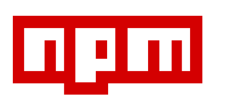
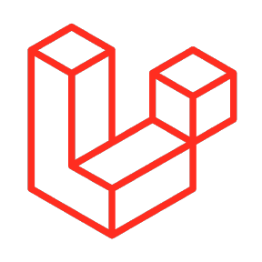

<h1 align="center">👋 Hi, I'm MrPowerUp</h1>
<h2 align="center">⚡ Electrical And 💻 Software Engineer</h2>

  <a href="https://mrpowerup82.github.io/"><strong>🌐 Portfólio</strong></a>

---

### 🌐 Outros Perfis

  &nbsp;&nbsp;
  &nbsp;&nbsp;
  &nbsp;&nbsp;
  

---

### 🖥️ Sistemas Operacionais

  
  
  
  
  
  

---

### 💻 Linguagens e Frameworks

  
  
  
  
  
  
  
  
  
  
  
  
  
  

---

### 📢 Badge Social

  
  

---

### 🚀 Projetos em Destaque

- 🔧 [MC Server Manager](https://github.com/MrPowerUp82/mcmanager)
- 🎵 [PySound](https://github.com/MrPowerUp82/Eel-MusicPlayer-Python)
- ⏱️ [Cron Manager](https://github.com/MrPowerUp82/cron-manager)
- 🧠 [pyLegends](https://github.com/MrPowerUp82/pyLegends)
- 🎬 [Filmaria](https://github.com/MrPowerUp82/filmaria-mobile)
- 🏦 [Itaú Shopline](https://github.com/MrPowerUp82/python_itaushopline)

---

### 🐍 GitHub Contribution Snake

  <picture>
    <source media="(prefers-color-scheme: dark)" srcset="https://raw.githubusercontent.com/MrPowerUp82/MrPowerUp82/output/github-contribution-grid-snake-dark.svg" />
    <source media="(prefers-color-scheme: light)" srcset="https://raw.githubusercontent.com/MrPowerUp82/MrPowerUp82/output/github-contribution-grid-snake-light.svg" />
    
  </picture>

---

### 📊 Estatísticas GitHub

  
   
  
   
  

---

  <strong>📈 Contador de Visitas</strong> 
  

